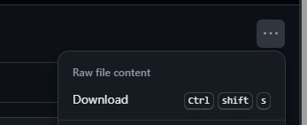
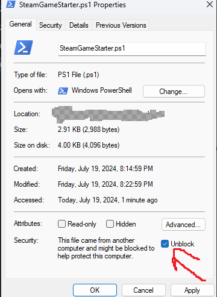
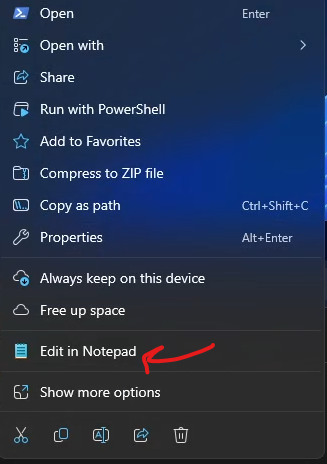
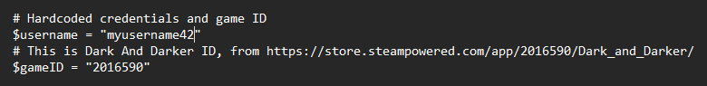
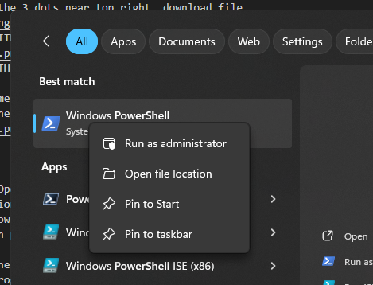
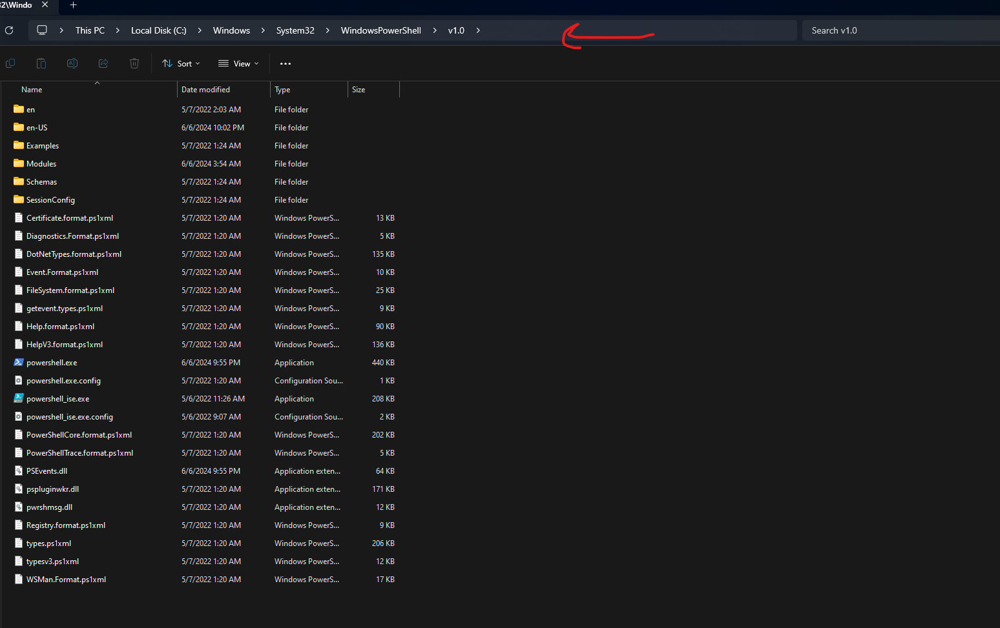
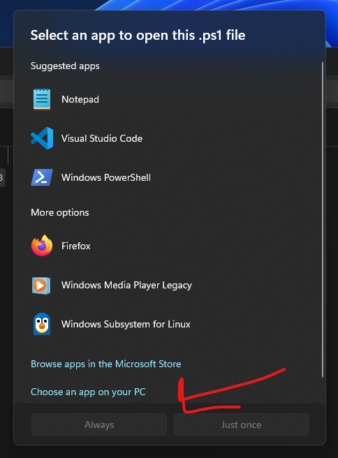
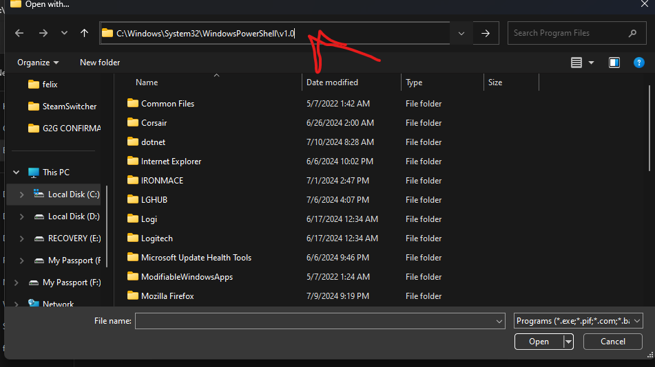
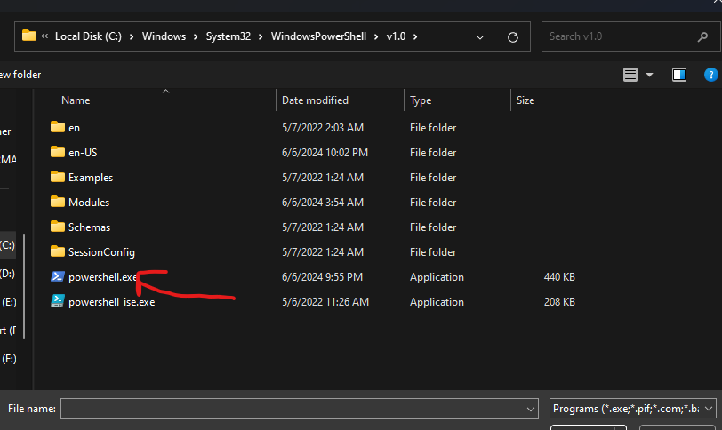

# Steam Game Starter
Starts games with a specific account. Just make a copy and edit the script to login to each account

This will only work if you have already logged into both accounts, clicked RememberMe on login box, and completed SteamGuard verification (where they email you a code). Once that is all done, this will let you launch a game with a specific steam username.

Works by modifying registry value of current user to set AutoLoginUser to whatever account you want. 
Instructions:
1. Download release
    Click SteamGameStarter.ps1 in files above
    On new page, click the 3 dots near top right, download file. 
    

2. Right click > PROPERTIES
    Unblock [X]
    

3. Right click > EDIT WITH NOTEPAD (should be at bottom)
    
    if not, use OPEN WITH... NOTEPAD but click "open with this ONCE"

4. Edit username and game id (currently set to dark and darker)
    gameID comes from the url of the steampage. numbers before the /GameName/. see the #note in script
    

5. Save & Close

6. Double left click > Open with powershell
    If thats not an option, search powershell in windows search.
    Right click it > show location. 
    
        if it takes you to a shortcut, right click the shortcut > show location.
    You should now be in powershell home(ex: C:\Windows\System32\WindowsPowerShell\v1.0). 
    Click the filepath at the top to highlight it and copy
    
    
    Double left click the SteamGameStarter.ps1 again 
    open with another program/choose another app. 
        (If this isnt working, try right clicking > open with...)
    Click Choose App from your pc (bottom)
    

    paste in the filepath at the top.
    
    select powershell.exe at the middle
    

    
7. Hit Always

